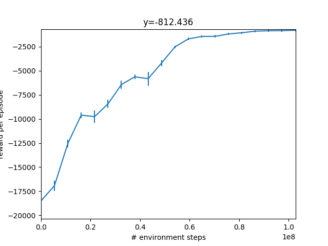
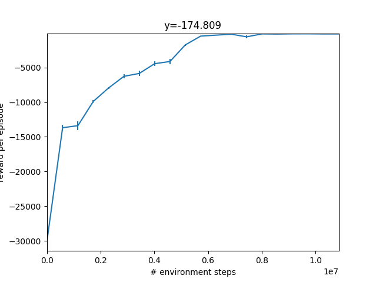
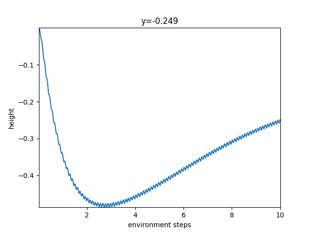
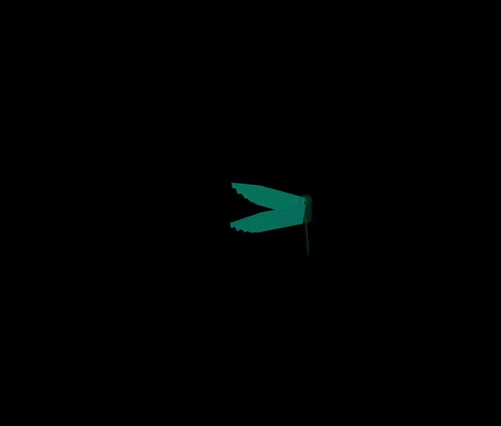

# Управление орнитоптером методами обучения с подкреплением (SAC, PPO)

С использованием [JAX](https://jax.readthedocs.io/) и
[MuJoCo MJX](https://mujoco.readthedocs.io/en/stable/mjx.html).

## Участники

Козлов Н.А. 466220

## Описание проводимого исследования

Целью работы является синтез регулятора методами RL для удержания высоты роботом орнитоптером.

Среда представляет собой орнитоптер, имеющий три актуатора на крылья (сферический шанир) и два на хвост. Крылья жестко связаны и выполняют движения синхронно. Базовое тело орнитоптера имеет три степени свобоы и может перемещаться только в плоскость Oxz. В данном решении не используется изменение морфологии крыла. 

В качестве алгоритмов обучения с подкреплением были использованы Proximal policy optimization и Soft actor-critic. 

### Описание алгоритмов

Proximal policy optimization - on-policy алгоритм, один из градиентных методов. Имеет следующие шаги:

    - Сбор данных в среде.

    - Оценка преимущества (advantages). Показывает, насколько лучше или хуже было выбранное действие по сравнению со средним действием агента в этом состоянии.

    - Обновление политики. Собранные данные используются для обновления политики несколько раз.

    - Клиппирование. Основной механизм PPO необходимой для безопасного изменения политики и обеспечения стабильности. Соотношение вероятностей по старой политике к вероятностям по новой ограничевается $[1-\epsilon, 1+\epsilon]$ 

Главное преимущество - стабильность.

Soft actor critic - off-policy алгоритм. Для алгоритма необходимо сеть actor для выбора действий, чтобы максимизировать награду и энтропию. Две сети критиков для оценки качесва пар состояние-действие. Две сети необходимы дляборьбы с переоценкой действий. И две сети целевых критиков для стабилизации обучения. Имеет следующие шаги:

    -Сбор данных в буфере воспроизведения (Replay Buffer): Агент взаимодействует со средой и сохраняет свой опыт в большой буфер. Ключевое отличие от PPO: может использовать опыт, собранный когда угодно в прошлом (off-policy).

    -Обновление Критиков: Мы случайно выбираем "батч" опыта из буфера. Критики ($Q$) учатся предсказывать Q-ценность, используя награду и оценку будущей ценности от целевых критиков. Благодаря буферу мы можем перемешивать и многократно использовать старые данные.

    -Обновление actor сети: Обновляется так, чтобы выбирать действия, которые дают высокую оценку от сетей критиков, но при этом сама политика должна иметь высокую энтропию.

Менее стабилен, сложен в настройке, более вычислительно сложен. Однако имеет высокую эффеективность к настраиваемым данным, и высокую робастность.

### Описание среды

Функция наград представляет собой следующее выражение:
$$
R = -\| \mathbf{\delta x} \|_2
$$
 где $\delta x$ - вектор расстояний до целевой точки.

В работе используются стандартные значения плотности и вязкости воздуха (стандартная атмосфера). Ускорение свободного падения равно 5 для упрощения обучения, поскольку изменение морфологии ограничено.

### Результаты обучения 

Процесс обучения приведены на графиках ниже:


&nbsp;&nbsp;&nbsp;


На графиках видно, что SAC сходится быстрее, PPO сходится более стабильно. Политика, обученная алгоритмом PPO не регулирует положение орнитоптера. Процесс регулирования политикой обученной SAC представлен на рисунке ниже:



## Демонстрация работы

Демонстарция запуска визуализации по [ссылке](https://drive.google.com/file/d/1nD46mVB0GjXdsE9univYCHuQVHb6Rzfm/view?usp=sharing)



Демонстарция запуска обучения по [ссылке](https://drive.google.com/file/d/1mzosN4c1lWQh43kfUqco2kbOuWKt-0I_/view?usp=sharing)

Демонстарция запуска валидации по [ссылке](https://drive.google.com/file/d/1I5tEupWSYs4iVgIJxE_ifOzuMfkRL5-t/view?usp=sharing)

## Развертывание и запуск

Склонируйте репозиторий:

```bash
git clone https://github.com/Peetearr/bird.git
cd bird
```

Установите зависимости:

```bash
conda env create -f environment.yaml
```

Активируйте conda окружение:

```bash
conda activate bird-mjx
```

Для запуска обучения выполните команду с указанием необходимого rl алгоритма (по умолчанию SAC):

```bash
python src/train.py --alg sac
```

Для запуска визуализации полиитики выполните команду с указанием пути до папки с сохраненной моделью (только для sac):

```bash
python src/vis_policy.py --path /home/user/bird/logs/sac/best_policy
```

Аналогично для валидации модели по высоте (только для sac):

```bash
python src/vis_policy.py --path /home/user/bird/logs/sac/best_policy
```

## Результаты

В результате выполнения работы была обучена сеть политики для управления орнитоптером методами PPO и SAC. Сеть PPO не справляется с поставленной задачей. Сеть actor SAC выполняет стабилизацию со статической ошибкой.